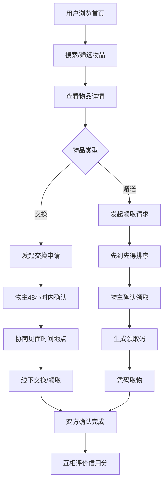

## 1. 产品概述

社区二手物品交换与赠送平台，面向居民用户，提供闲置物品的交换和免费赠送服务。通过物品循环利用减少浪费，增进社区邻里互动，建立基于信用的社区共享生态。

## 2. 核心功能

### 2.1 用户角色

| 角色 | 注册方式 | 核心权限 |
|------|----------|----------|
| 普通用户 | 手机号/用户名注册 | 发布物品、浏览搜索、发起交换/领取、信用评价、个人中心 |
| 管理员 | 后台账号登录 | 物品管理、用户管理、投诉处理、违规下架、系统配置 |

### 2.2 功能模块

1. **首页**：物品分类导航、搜索筛选、物品列表（按分类/距离排序）、热门推荐
2. **物品发布**：选择交换/赠送模式、上传照片、填写描述、新旧程度、期望交换类别
3. **物品详情**：物品信息展示、物主信息、发起交换申请/领取请求
4. **消息中心**：交换/领取通知、申请状态提醒、互评提醒
5. **交换流程**：发起申请 → 物主确认（48小时）→ 协商见面 → 双方确认 → 互评信用
6. **赠送流程**：领取请求 → 先到先得 → 物主确认 → 自动生成领取码 → 凭码取物
7. **个人主页**：发布记录、交换记录、信用评分、收藏列表
8. **信用系统**：信用分计算、放鸽子记录、自动冻结机制（连续3次放鸽子冻结30天）
9. **管理后台**：物品审核、用户管理、投诉处理、违规下架、数据统计

### 2.3 页面详情

| 页面名称 | 模块名称 | 功能描述 |
|----------|----------|----------|
| 首页 | 顶部导航栏 | Logo、搜索框、分类导航、发布按钮、消息入口、个人中心入口 |
| 首页 | 筛选栏 | 物品类型筛选（全部/交换/赠送）、分类筛选、距离筛选、排序方式 |
| 首页 | 物品列表 | 卡片式展示物品图片、标题、价格/类型、新旧程度、距离、发布时间 |
| 物品详情页 | 物品展示区 | 轮播图、物品标题、类型标签、新旧程度、发布时间、浏览量 |
| 物品详情页 | 物品描述 | 详细描述、期望交换类别（交换模式）、物品位置 |
| 物品详情页 | 物主信息 | 头像、昵称、信用分、发布物品数 |
| 物品详情页 | 操作区 | 发起交换申请/领取请求、收藏、分享 |
| 发布页面 | 表单区 | 物品类型选择、图片上传、标题、描述、分类、新旧程度、期望交换类别 |
| 个人中心页 | 个人信息 | 头像、昵称、信用分、放鸽子次数、冻结状态 |
| 个人中心页 | 功能菜单 | 我的发布、交换记录、收藏夹、账号设置 |
| 消息中心页 | 消息列表 | 系统通知、交换申请、领取通知、互评提醒 |
| 管理后台 | 数据概览 | 用户数、物品数、交换数、投诉数统计 |
| 管理后台 | 物品管理 | 物品列表、审核、下架、搜索筛选 |
| 管理后台 | 用户管理 | 用户列表、信用调整、冻结/解冻、搜索筛选 |
| 管理后台 | 投诉管理 | 投诉列表、处理、回复、搜索筛选 |

## 3. 核心流程

### 3.1 物品发布流程
用户登录 → 点击发布 → 选择物品类型（交换/赠送）→ 上传图片 → 填写标题描述 → 选择分类 → 选择新旧程度 → 填写期望交换类别（交换模式）→ 提交发布

### 3.2 物品交换流程
浏览物品 → 发起交换申请 → 物主48小时内确认 → 双方协商见面时间地点 → 线下交换 → 双方确认完成 → 互相评价信用分

### 3.3 物品赠送流程
浏览物品 → 发起领取请求 → 先到先得自动排序 → 物主确认领取 → 系统生成领取码 → 凭码取物 → 双方确认完成 → 评价

### 3.4 信用惩罚机制
用户放鸽子 → 记录放鸽子次数 → 连续3次放鸽子 → 系统自动冻结发布权限30天 → 冻结期满自动解冻

### 3.5 管理员流程
管理员登录 → 查看违规物品/投诉 → 审核处理 → 下架违规物品/处罚用户 → 记录处理结果

## 4. 用户界面设计

### 4.1 设计风格

- **主色调**：温暖的绿色系（#22c55e）作为主色，传递环保、分享、社区的理念
- **辅助色**：橙色（#f97316）用于强调操作按钮和重要提示
- **中性色**：暖灰色系（#f8fafc 至 #1e293b），营造温馨舒适的社区氛围
- **按钮风格**：圆角矩形按钮，hover时有轻微上浮和阴影效果
- **字体**：系统字体 + 中文优化，标题加粗清晰，正文易读舒适
- **布局风格**：卡片式布局，柔和阴影，充足留白，圆润边角
- **图标风格**：线性图标，统一2px描边，圆角处理

### 4.2 页面设计概览

| 页面名称 | 模块名称 | UI元素 |
|----------|----------|--------|
| 首页 | 顶部导航 | 固定顶部、绿色背景、白色文字、搜索框居中、右侧功能按钮 |
| 首页 | 分类导航 | 横向滚动图标分类、彩色图标、选中态高亮 |
| 首页 | 筛选栏 | 标签式筛选、下拉选择器、切换按钮 |
| 首页 | 物品列表 | 响应式网格布局、卡片悬停上浮效果、图片懒加载 |
| 物品详情页 | 图片轮播 | 大图展示、左右切换、指示器、缩放预览 |
| 物品详情页 | 信息区 | 标签徽章、标题层级、信息图标化展示 |
| 物品详情页 | 操作按钮 | 底部悬浮操作栏、主按钮突出 |
| 发布页面 | 表单 | 分步骤引导、左侧步骤条、表单校验提示 |
| 个人中心页 | 信息卡片 | 渐变背景头像区、信用分圆环图、数据统计 |
| 个人中心页 | 菜单列表 | 图标+文字、右侧箭头、分割线 |
| 管理后台 | 侧边栏 | 深色侧边导航、折叠展开、选中高亮 |
| 管理后台 | 数据看板 | 统计卡片、数据图表、颜色区分 |

### 4.3 响应式

- 桌面端优先设计，适配1280px及以上屏幕
- 平板端（768px-1279px）：两列布局，侧边导航折叠
- 移动端（<768px）：单列布局，底部导航，汉堡菜单
- 触摸优化：按钮最小44x44px，足够的点击区域

### 4.4 动效与交互

- 页面切换：淡入淡出过渡
- 卡片悬停：轻微上浮 + 阴影加深
- 按钮点击：缩放反馈
- 列表加载：骨架屏占位
- 表单校验：实时提示动画
- 消息通知：右上角滑入
