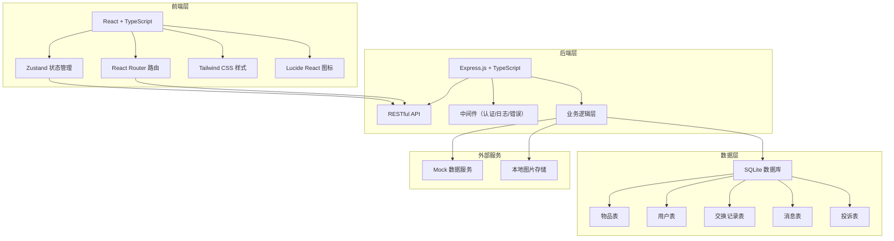
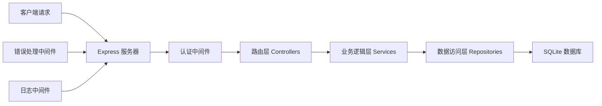
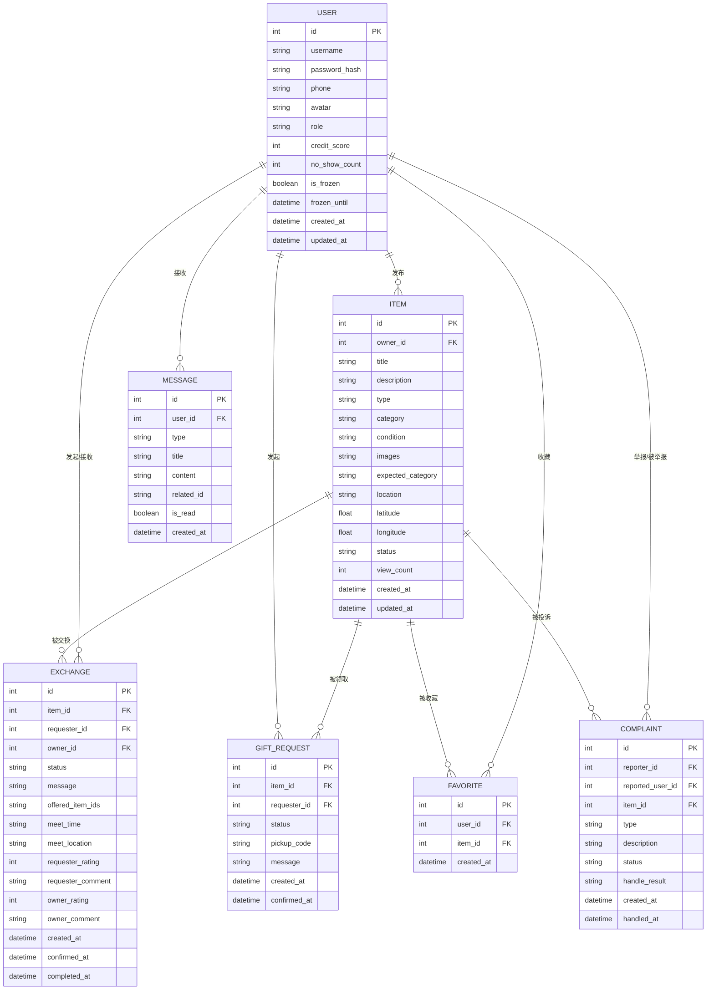

## 1. 架构设计



## 2. 技术描述

- **前端**：React@18 + TypeScript + Vite
- **后端**：Express@4 + TypeScript
- **状态管理**：Zustand
- **路由**：React Router DOM v6
- **样式**：Tailwind CSS@3
- **图标**：Lucide React
- **数据库**：SQLite（开发环境）+ better-sqlite3
- **认证**：JWT Token
- **文件上传**：本地存储 + multer
- **初始化工具**：vite-init

## 3. 路由定义

### 前端路由

| 路由路径 | 页面名称 | 说明 |
|----------|----------|------|
| / | 首页 | 物品列表、搜索筛选、分类导航 |
| /item/:id | 物品详情页 | 物品信息、发起交换/领取 |
| /publish | 发布物品页 | 发布新物品表单 |
| /profile | 个人中心 | 个人信息、功能菜单 |
| /profile/items | 我的发布 | 已发布物品列表 |
| /profile/exchanges | 交换记录 | 交换/赠送历史记录 |
| /profile/favorites | 我的收藏 | 收藏的物品列表 |
| /messages | 消息中心 | 系统通知、交换消息 |
| /login | 登录页 | 用户登录 |
| /register | 注册页 | 用户注册 |
| /admin | 管理后台首页 | 数据概览 |
| /admin/items | 物品管理 | 物品列表、下架操作 |
| /admin/users | 用户管理 | 用户列表、冻结操作 |
| /admin/complaints | 投诉管理 | 投诉处理 |

### 后端API路由

| 路由前缀 | 模块 | 说明 |
|----------|------|------|
| /api/auth | 认证模块 | 注册、登录、获取用户信息 |
| /api/items | 物品模块 | 物品CRUD、搜索筛选 |
| /api/exchanges | 交换模块 | 交换申请、确认、完成、评价 |
| /api/gifts | 赠送模块 | 领取请求、确认、领取码 |
| /api/users | 用户模块 | 用户信息、信用分、收藏 |
| /api/messages | 消息模块 | 消息列表、已读标记 |
| /api/admin | 管理员模块 | 物品管理、用户管理、投诉处理 |
| /api/uploads | 上传模块 | 图片上传 |

## 4. API 定义

### 4.1 认证模块

```typescript
// 用户注册
POST /api/auth/register
Request: { username: string; password: string; phone?: string; avatar?: string }
Response: { id: number; username: string; token: string }

// 用户登录
POST /api/auth/login
Request: { username: string; password: string }
Response: { id: number; username: string; token: string; role: string }

// 获取当前用户信息
GET /api/auth/me
Response: User
```

### 4.2 物品模块

```typescript
// 获取物品列表
GET /api/items?page=1&pageSize=20&category=&type=&sort=&keyword=
Response: { list: Item[]; total: number }

// 获取物品详情
GET /api/items/:id
Response: Item

// 发布物品
POST /api/items
Request: {
  title: string;
  description: string;
  type: 'exchange' | 'gift';
  category: string;
  condition: 'new' | 'like_new' | 'good' | 'fair' | 'poor';
  images: string[];
  expectedCategory?: string;
  location: string;
  latitude?: number;
  longitude?: number;
}
Response: Item

// 更新物品
PUT /api/items/:id
Response: Item

// 删除/下架物品
DELETE /api/items/:id
Response: { success: boolean }

// 收藏物品
POST /api/items/:id/favorite
Response: { success: boolean; isFavorite: boolean }
```

### 4.3 交换模块

```typescript
// 发起交换申请
POST /api/exchanges
Request: { itemId: number; message?: string; offeredItemIds?: number[] }
Response: Exchange

// 获取交换列表
GET /api/exchanges?status=
Response: Exchange[]

// 物主确认交换
POST /api/exchanges/:id/confirm
Response: Exchange

// 拒绝交换申请
POST /api/exchanges/:id/reject
Response: Exchange

// 协商见面信息
POST /api/exchanges/:id/negotiate
Request: { meetTime: string; meetLocation: string }
Response: Exchange

// 确认完成交换
POST /api/exchanges/:id/complete
Response: Exchange

// 评价
POST /api/exchanges/:id/review
Request: { rating: number; comment?: string }
Response: Exchange

// 举报放鸽子
POST /api/exchanges/:id/no-show
Response: { success: boolean }
```

### 4.4 赠送模块

```typescript
// 发起领取请求
POST /api/gifts/request
Request: { itemId: number; message?: string }
Response: GiftRequest

// 获取领取请求列表
GET /api/gifts/requests?itemId=
Response: GiftRequest[]

// 确认领取人
POST /api/gifts/requests/:id/confirm
Response: { pickupCode: string; giftRequest: GiftRequest }

// 凭码取物确认
POST /api/gifts/verify
Request: { itemId: number; pickupCode: string }
Response: { success: boolean }
```

### 4.5 用户模块

```typescript
// 获取用户信息
GET /api/users/:id
Response: User

// 获取用户信用分
GET /api/users/:id/credit
Response: { creditScore: number; noShowCount: number; isFrozen: boolean }

// 获取收藏列表
GET /api/users/favorites
Response: Item[]
```

### 4.6 消息模块

```typescript
// 获取消息列表
GET /api/messages?type=
Response: Message[]

// 标记已读
POST /api/messages/:id/read
Response: { success: boolean }

// 全部已读
POST /api/messages/read-all
Response: { success: boolean }
```

### 4.7 管理员模块

```typescript
// 数据统计
GET /api/admin/stats
Response: { userCount: number; itemCount: number; exchangeCount: number; complaintCount: number }

// 物品列表
GET /api/admin/items
Response: { list: Item[]; total: number }

// 下架物品
POST /api/admin/items/:id/remove
Request: { reason: string }
Response: { success: boolean }

// 用户列表
GET /api/admin/users
Response: { list: User[]; total: number }

// 冻结/解冻用户
POST /api/admin/users/:id/freeze
Request: { days: number; reason: string }
Response: { success: boolean; isFrozen: boolean }

// 投诉列表
GET /api/admin/complaints
Response: { list: Complaint[]; total: number }

// 处理投诉
POST /api/admin/complaints/:id/handle
Request: { result: string }
Response: Complaint
```

## 5. 服务器架构图



## 6. 数据模型

### 6.1 数据模型定义



### 6.2 DDL 语句

```sql
-- 用户表
CREATE TABLE users (
  id INTEGER PRIMARY KEY AUTOINCREMENT,
  username VARCHAR(50) UNIQUE NOT NULL,
  password_hash VARCHAR(255) NOT NULL,
  phone VARCHAR(20),
  avatar VARCHAR(255),
  role VARCHAR(20) DEFAULT 'user',
  credit_score INTEGER DEFAULT 100,
  no_show_count INTEGER DEFAULT 0,
  is_frozen BOOLEAN DEFAULT 0,
  frozen_until DATETIME,
  created_at DATETIME DEFAULT CURRENT_TIMESTAMP,
  updated_at DATETIME DEFAULT CURRENT_TIMESTAMP
);

-- 物品表
CREATE TABLE items (
  id INTEGER PRIMARY KEY AUTOINCREMENT,
  owner_id INTEGER NOT NULL,
  title VARCHAR(100) NOT NULL,
  description TEXT,
  type VARCHAR(20) NOT NULL,
  category VARCHAR(50) NOT NULL,
  condition VARCHAR(20) NOT NULL,
  images TEXT,
  expected_category VARCHAR(50),
  location VARCHAR(255),
  latitude REAL,
  longitude REAL,
  status VARCHAR(20) DEFAULT 'active',
  view_count INTEGER DEFAULT 0,
  created_at DATETIME DEFAULT CURRENT_TIMESTAMP,
  updated_at DATETIME DEFAULT CURRENT_TIMESTAMP,
  FOREIGN KEY (owner_id) REFERENCES users(id)
);

-- 交换记录表
CREATE TABLE exchanges (
  id INTEGER PRIMARY KEY AUTOINCREMENT,
  item_id INTEGER NOT NULL,
  requester_id INTEGER NOT NULL,
  owner_id INTEGER NOT NULL,
  status VARCHAR(20) DEFAULT 'pending',
  message TEXT,
  offered_item_ids TEXT,
  meet_time DATETIME,
  meet_location VARCHAR(255),
  requester_rating INTEGER,
  requester_comment TEXT,
  owner_rating INTEGER,
  owner_comment TEXT,
  created_at DATETIME DEFAULT CURRENT_TIMESTAMP,
  confirmed_at DATETIME,
  completed_at DATETIME,
  FOREIGN KEY (item_id) REFERENCES items(id),
  FOREIGN KEY (requester_id) REFERENCES users(id),
  FOREIGN KEY (owner_id) REFERENCES users(id)
);

-- 赠送领取表
CREATE TABLE gift_requests (
  id INTEGER PRIMARY KEY AUTOINCREMENT,
  item_id INTEGER NOT NULL,
  requester_id INTEGER NOT NULL,
  status VARCHAR(20) DEFAULT 'pending',
  pickup_code VARCHAR(20),
  message TEXT,
  created_at DATETIME DEFAULT CURRENT_TIMESTAMP,
  confirmed_at DATETIME,
  FOREIGN KEY (item_id) REFERENCES items(id),
  FOREIGN KEY (requester_id) REFERENCES users(id)
);

-- 消息表
CREATE TABLE messages (
  id INTEGER PRIMARY KEY AUTOINCREMENT,
  user_id INTEGER NOT NULL,
  type VARCHAR(50) NOT NULL,
  title VARCHAR(100) NOT NULL,
  content TEXT,
  related_id INTEGER,
  is_read BOOLEAN DEFAULT 0,
  created_at DATETIME DEFAULT CURRENT_TIMESTAMP,
  FOREIGN KEY (user_id) REFERENCES users(id)
);

-- 收藏表
CREATE TABLE favorites (
  id INTEGER PRIMARY KEY AUTOINCREMENT,
  user_id INTEGER NOT NULL,
  item_id INTEGER NOT NULL,
  created_at DATETIME DEFAULT CURRENT_TIMESTAMP,
  UNIQUE(user_id, item_id),
  FOREIGN KEY (user_id) REFERENCES users(id),
  FOREIGN KEY (item_id) REFERENCES items(id)
);

-- 投诉表
CREATE TABLE complaints (
  id INTEGER PRIMARY KEY AUTOINCREMENT,
  reporter_id INTEGER NOT NULL,
  reported_user_id INTEGER NOT NULL,
  item_id INTEGER,
  type VARCHAR(50) NOT NULL,
  description TEXT,
  status VARCHAR(20) DEFAULT 'pending',
  handle_result TEXT,
  created_at DATETIME DEFAULT CURRENT_TIMESTAMP,
  handled_at DATETIME,
  FOREIGN KEY (reporter_id) REFERENCES users(id),
  FOREIGN KEY (reported_user_id) REFERENCES users(id),
  FOREIGN KEY (item_id) REFERENCES items(id)
);

-- 索引
CREATE INDEX idx_items_type ON items(type);
CREATE INDEX idx_items_category ON items(category);
CREATE INDEX idx_items_status ON items(status);
CREATE INDEX idx_items_owner ON items(owner_id);
CREATE INDEX idx_exchanges_requester ON exchanges(requester_id);
CREATE INDEX idx_exchanges_owner ON exchanges(owner_id);
CREATE INDEX idx_exchanges_status ON exchanges(status);
CREATE INDEX idx_messages_user ON messages(user_id);
CREATE INDEX idx_messages_read ON messages(is_read);
```

## 7. 项目目录结构

```
.
├── src/                      # 前端源码
│   ├── components/           # 公共组件
│   │   ├── Layout/           # 布局组件
│   │   ├── ItemCard/         # 物品卡片
│   │   ├── Navbar/           # 导航栏
│   │   └── ...
│   ├── pages/                # 页面组件
│   │   ├── Home/             # 首页
│   │   ├── ItemDetail/       # 物品详情
│   │   ├── Publish/          # 发布物品
│   │   ├── Profile/          # 个人中心
│   │   ├── Messages/         # 消息中心
│   │   ├── Auth/             # 登录注册
│   │   └── Admin/            # 管理后台
│   ├── hooks/                # 自定义 Hooks
│   ├── store/                # Zustand 状态管理
│   ├── utils/                # 工具函数
│   ├── types/                # TypeScript 类型定义
│   ├── api/                  # API 请求封装
│   ├── App.tsx
│   ├── main.tsx
│   └── index.css
├── api/                      # 后端源码
│   ├── src/
│   │   ├── controllers/      # 控制器
│   │   ├── services/         # 业务逻辑
│   │   ├── repositories/     # 数据访问
│   │   ├── middleware/       # 中间件
│   │   ├── routes/           # 路由
│   │   ├── db/               # 数据库连接
│   │   ├── types/            # 类型定义
│   │   ├── utils/            # 工具函数
│   │   └── index.ts          # 入口文件
│   └── data/                 # 数据库文件
├── shared/                   # 共享类型
│   └── types.ts
├── vite.config.ts
├── tailwind.config.js
├── tsconfig.json
└── package.json
```
